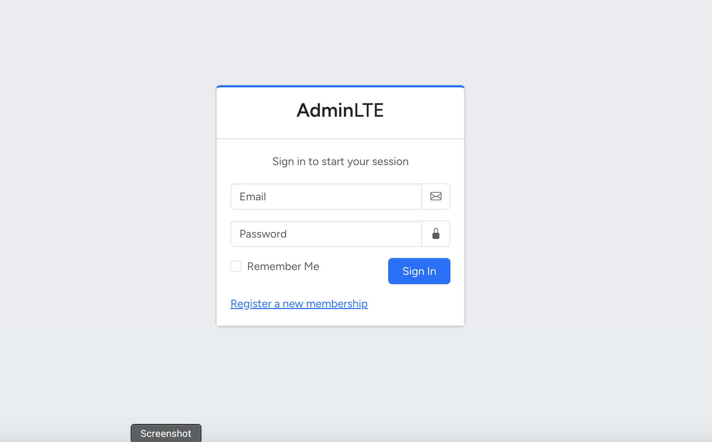
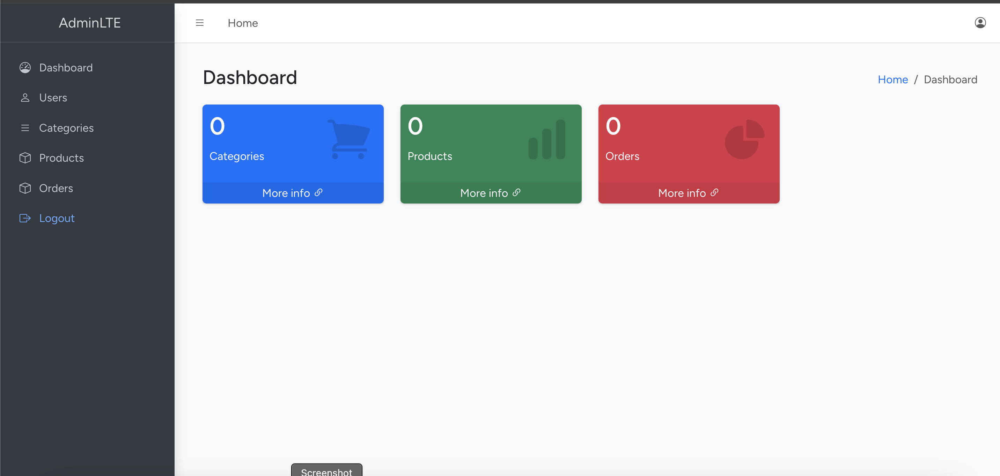
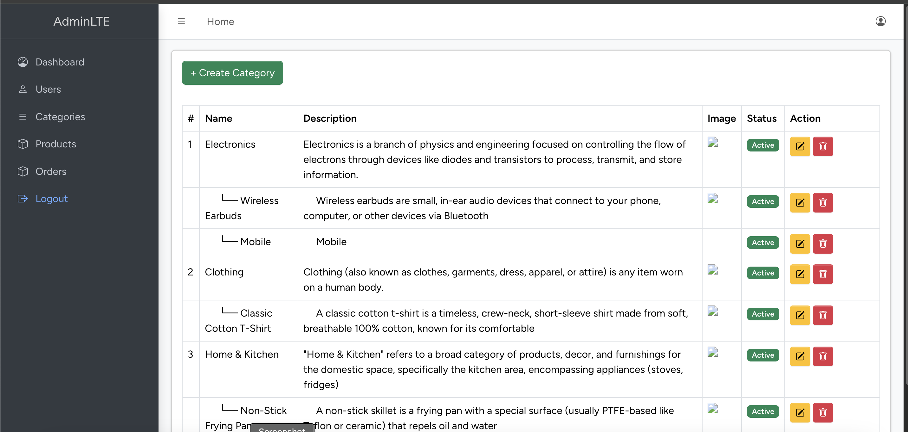
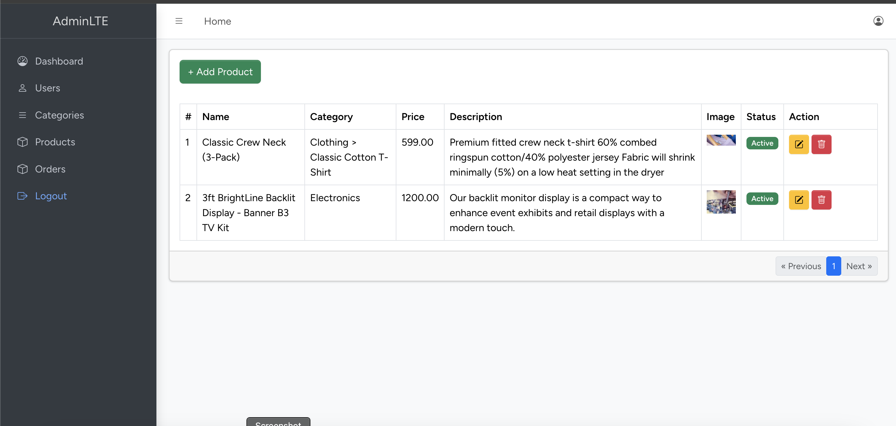
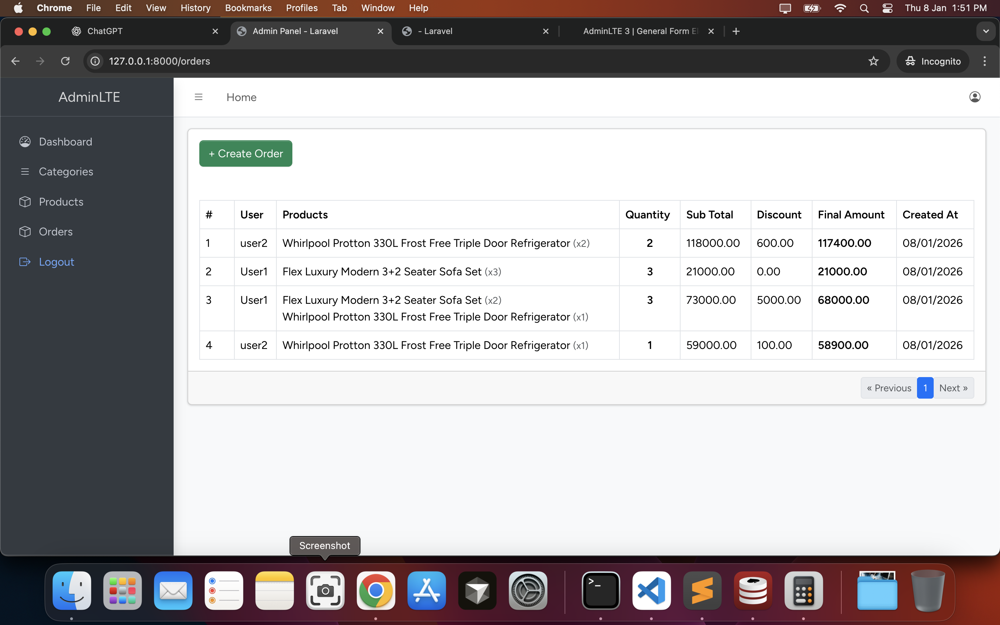
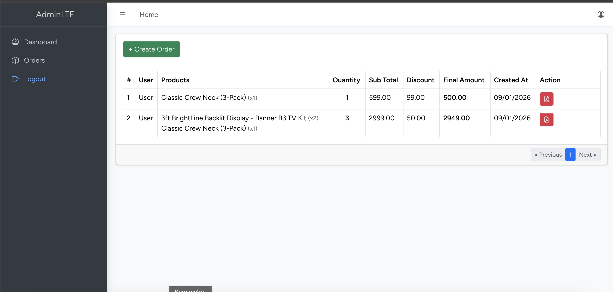

# Laravel E-commerce Website

An **E-commerce web application** built with **Laravel**, **Vue.js**, and **Inertia.js**, using the **AdminLTE** theme for the admin dashboard UI.

This project demonstrates role-based access control, product & order management, and a modern Laravel + Vue SPA experience.

---

## ✨ Features

### Authentication & Authorization

* User registration & login
* Role & permission management
* Admin can create users and assign permissions

### Admin Panel

* Manage users
* Create & manage categories
* Create & manage products
* Create (book) orders for users
* View all orders in the system

### User Panel

* User authentication
* Users can place orders
* Users can view **only their own orders**

---

## 🛠 Tech Stack

* **Backend:** Laravel
* **Frontend:** Vue.js + Inertia.js
* **UI Theme:** AdminLTE
* **Database:** MySQL
* **Build Tool:** Vite
* **Authentication:** Laravel Auth
* **Package Manager:** Composer & NPM

---

## 🚀 Demo

### Admin Panel

```
URL: http://127.0.0.1:8000
Email: admin@test.com
Password: password
```

> ⚠️ Demo URL works only after running the project locally.

---

## 📦 Installation

### Prerequisites

Make sure you have the following installed:

* PHP **8.2+** (recommended)
* MySQL
* Composer
* Node.js (v18+ recommended)
* NPM

---

### Setup Instructions

1. **Clone the repository**

   ```bash
   git clone <repository-url>
   cd <project-folder>
   ```

2. **Checkout the orders branch**

   ```bash
   git checkout orders
   ```

3. **Create environment file**

   ```bash
   cp .env.example .env
   ```

4. **Configure database in `.env`**

   ```env
   DB_CONNECTION=mysql
   DB_HOST=127.0.0.1
   DB_PORT=3306
   DB_DATABASE=your_database_name
   DB_USERNAME=your_database_user
   DB_PASSWORD=your_database_password
   ```

5. **Install PHP dependencies**

   ```bash
   composer install
   ```

6. **Generate application key**

   ```bash
   php artisan key:generate
   ```

7. **Run migrations & seeders**

   ```bash
   php artisan migrate --seed
   ```

8. **Create storage symbolic link**
	```bash
   php artisan migrate --seed
   ```

9. **Install Node dependencies**

   ```bash
   npm install
   ```

   If you encounter dependency issues:

   ```bash
   npm install --legacy-peer-deps
   ```

10. **Start the Vite development server**

   ```bash
   npm run dev
   ```

11. **Start the Laravel development server**

    ```bash
    php artisan serve
    ```

12. **Access the application**

    ```
    http://127.0.0.1:8000
    ```

---

## 👤 Default Admin Credentials

```text
Email: admin@test.com
Password: password
```

---

## 📁 Project Structure (Highlights)

* `app/Models` – Eloquent models
* `app/Http/Controllers` – Application controllers
* `resources/js` – Vue.js & Inertia frontend
* `resources/views` – Blade layouts (AdminLTE)
* `routes/web.php` – Web routes
* `database/seeders` – Demo data & admin user

---

## 🧪 Database Seeding

The project includes seeders that:

* Create an admin user
* Create sample users
* Populate roles & permissions

---

## ⚠️ Common Issues

* **Vite not loading?**
  Make sure `npm run dev` is running.

* **Permission denied on storage/logs?**

  ```bash
  chmod -R 775 storage bootstrap/cache
  ```

* **Key not set error?**

  ```bash
  php artisan key:generate
  ```

---

## 📌 Future Improvements (Optional)

* Order payment integration
* Order status tracking
* API support for mobile apps
* Unit & feature tests


---

## 📸 Screenshots

> Below are some screenshots showcasing the main features of the application.

### 🔐 Login Page



---

### 🏠 Admin Dashboard



---

### 👥 User Management (Admin)


---

### 🗂 Category Management



---

### 📦 Product Management



---

### 🛒 Orders Management (Admin)



---

### 👤 User Orders View



---